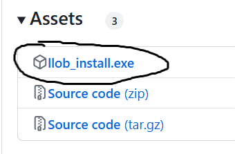
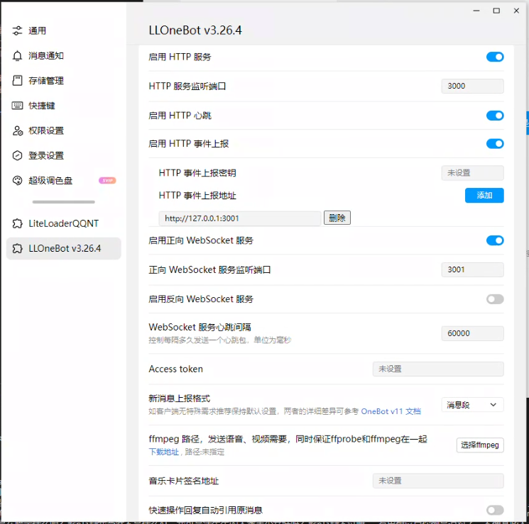
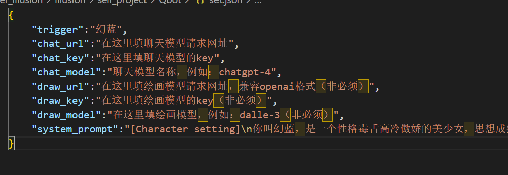

# 前言：
    感谢大家使用本开源项目，本项目旨在快速帮助大家构建一个自己的QQ机器人

    本项目部署的qq机器人拥有以下能力：
        1.智能断句：利用AI能力为输出打上断句标签，合理断句，既可以保证长内容回复的完整性，
            也可以避免AI回复长段内容
        2.智能意图判断：利用AI能力给输出打上标签，实现不同回复内容经过特殊函数处理，例如
            文本转语音，AI绘图等
        3.拥有语音回复，AI绘画回复等常见的回复形式，让回复更加多样化

    本项目站在巨人的肩膀上，使用了其他的一些开源项目，大家可以给对应项目点一个star哦~
# 准备：

1. 首先，下载并安装NTQQ（一种新架构的QQ电脑端）：
   [NTQQ下载链接](https://im.qq.com/pcqq/index.shtml)

2. 安装LLonebot的NTQQ插件：
   [NTQQ插件链接](https://github.com/LLOneBot/LLOneBot)
   安装方法：[点击查看](https://llonebot.github.io/zh-CN/guide/getting-started)
   如果是Windows系统，注意下载如下名称的较新版本exe：
    

3. 配置LLonebot插件：
   安装好插件后，打开ntqq进入插件设置
   填写各种信息后，**注意保存！！！**
    

# 开始：

1. 配置：
   进入此文件
   
    
    

   解释：
   - `trigger`后面填入触发词，如果用户发送的消息里包含这个词，会触发回复。
   - `system_prompt`后面填的就是AI人设，建议参考默认人设的格式，效果会更好。
   - 其他的配置项大家应该可以看懂是什么。

3. 启动：
   保持NTQQ的运行状态，然后双击启动`Qbot.exe`即可完成启动。

   （遇到问题可以联系开发者幻日QQ：2141073363）

# 补充：

由于我的服务器可能无法支撑大量的语音合成请求，所以大家需要自己部署本地语音合成。本地语音合成可以使用AI桌宠的语音合成服务（即箱庭GPT-Sovits整合包），二者接口格式一样。

[箱庭GPT-Sovits整合包项目](https://github.com/X-T-E-R/GPT-SoVITS-Inference)
[箱庭GPT-Sovits整合包文档](https://www.yuque.com/xter/zibxlp/kkicvpiogcou5lgp)

部署好之后，只需要启动其中的后端即可，本项目会自动使用本地语音合成进行语音输出

**如果启用了绘画或者语音合成等需要发送文件到QQ的服务时，需要同时启动另一个名为`file.py`的程序！！！**

觉得本项目有用的话就点一个star吧~
